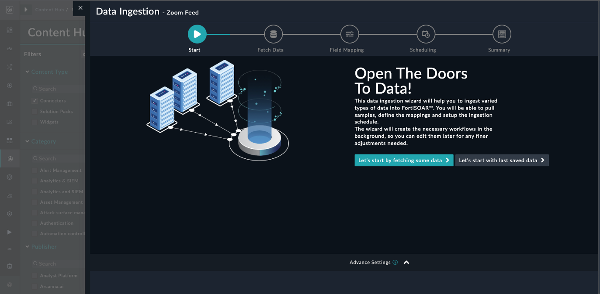
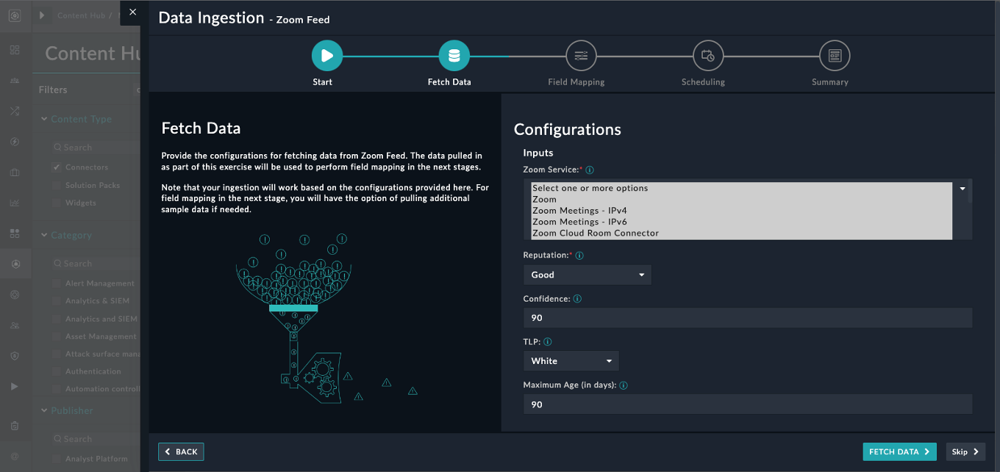
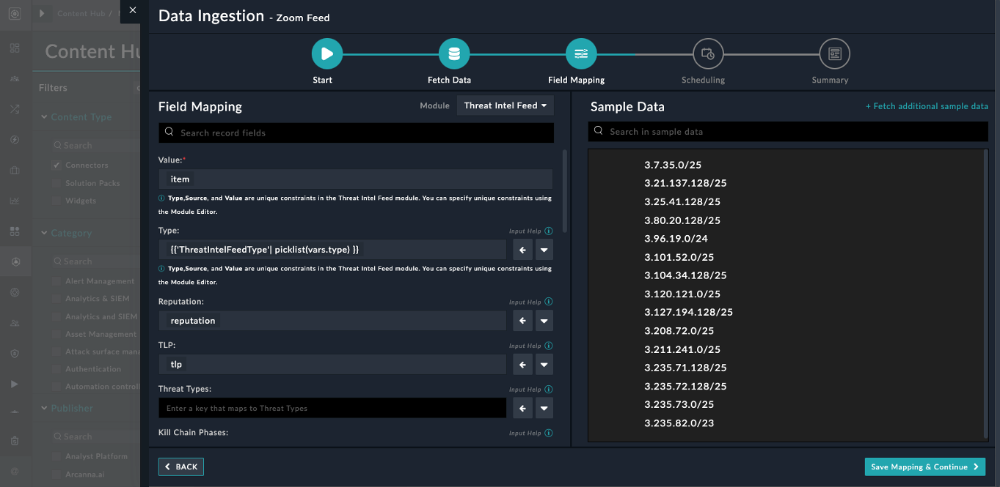
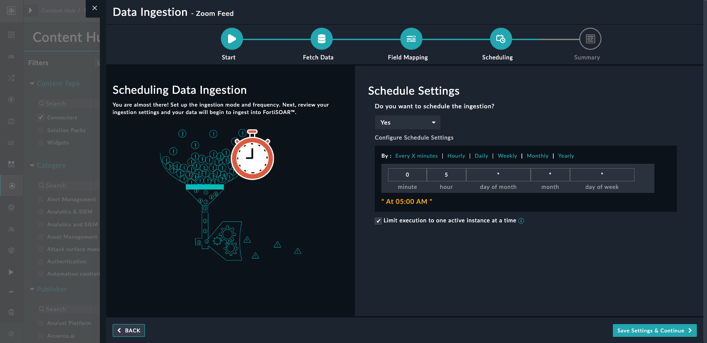

## About the connector
Zoom publishes its current IP address ranges in txt files. This connector facilitates automated operations to fetch these indicators and ingestion of daily threat feeds. This connector has a dependency on the <a href="/content-hub/all-content/?contentType=solutionpack&amp;tag=ThreatIntelManagement" target="_blank" rel="noopener">Threat Intel Management Solution Pack</a>. Install the Solution Pack before enabling ingestion of Threat Feeds from this source.

This document provides information about the Zoom Feed Connector, which facilitates automated interactions, with a Zoom Feed server using FortiSOAR&trade; playbooks. Add the Zoom Feed Connector as a step in FortiSOAR&trade; playbooks and perform automated operations with Zoom Feed.

### Version information

Connector Version: 1.0.0

Authored By: Fortinet

Certified: No
## Installing the connector

Use the <strong>Content Hub</strong> to install the connector. For the detailed procedure to install a connector, click <a href="https://docs.fortinet.com/document/fortisoar/0.0.0/installing-a-connector/1/installing-a-connector" target="_top">here</a>.

You can also use the <code>yum</code> command as a root user to install the connector:

<pre>yum install cyops-connector-zoom-feed</pre>

## Prerequisites to configuring the connector
- The FortiSOAR&trade; server should have outbound connectivity to port 443 on the Zoom Feed server.

## Minimum Permissions Required
- Not applicable

## Configuring the connector
For the procedure to configure a connector, click [here](https://docs.fortinet.com/document/fortisoar/0.0.0/configuring-a-connector/1/configuring-a-connector)
### Configuration parameters

In FortiSOAR&trade;, on the Connectors page, click the <strong>Zoom Feed</strong> connector row (if you are in the <strong>Grid</strong> view on the Connectors page) and in the <strong>Configurations</strong> tab enter the required configuration details:

<table border=1><thead><tr><th>Parameter</th><th>Description</th></tr></thead><tbody><tr><td>Server URL</td><td>Server url to get Zoom feeds data. By default it is set to https://assets.zoom.us/docs/ipranges
</td>
</tr><tr><td>Verify SSL</td><td>Specifies whether the SSL certificate for the server is to be verified or not.  By default, this option is set to True.</td></tr>
</tbody></table>

## Actions supported by the connector
The following automated operations can be included in playbooks and you can also use the annotations to access operations from FortiSOAR&trade; release 4.10.0 and onwards:
<table border=1><thead><tr><th>Function</th><th>Description</th><th>Annotation and Category</th></tr></thead><tbody><tr><td>Get Indicators</td><td>Retrieves a list of all indicators from Zoom Feed.</td><td>get_indicators  Investigation</td></tr>
</tbody></table>

### operation: Get Indicators
#### Input parameters
<table border=1><thead><tr><th>Parameter</th><th>Description</th></tr></thead><tbody><tr><td>Zoom Service</td><td>Select service for which you wants to retrieve indicators. You can choose one or more from "Zoom", "Zoom Meetings - IPv4", "Zoom Meetings - IPv6", "Zoom Cloud Room Connector", "Zoom Phone - IPv4", "Zoom Phone - IPv6", "Zoom Contact Center - IPv4", "Zoom Contact Center - IPv6", "Zoom CDN - IPv4", "Zoom CDN - IPv6", "Zoom Apps", "Zoom Apps - IPv6"
</td></tr><tr><td>Modified After</td><td>(Optional) Specify the time to retrieve Indicators. Indicators will be retrieved only if file is modified after specified time.
</td></tr></tbody></table>

#### Output
The output contains the following populated JSON schema:

<pre>{
    "Zoom": [],
    "Zoom Meetings - IPv4": [],
    "Zoom Meetings - IPv6": [],
    "Zoom Cloud Room Connector": [],
    "Zoom Phone - IPv4": [],
    "Zoom Phone - IPv6": [],
    "Zoom Contact Center - IPv4": [],
    "Zoom Contact Center - IPv6": [],
    "Zoom CDN - IPv4": [],
    "Zoom CDN - IPv6": [],
    "Zoom Apps": [],
    "Zoom Apps - IPv6": []
}</pre>
## Included playbooks
The `Sample - zoom-feed - 1.0.0` playbook collection comes bundled with the Zoom Feed connector. These playbooks contain steps using which you can perform all supported actions. You can see bundled playbooks in the **Automation** > **Playbooks** section in FortiSOAR&trade; after importing the Zoom Feed connector.

- `> Zoom Feed >> Fetch and Create`
- `>> Zoom Feed >>> Create`
- `Get Indicators`
- `Zoom Feed > Ingest`

**Note**: If you are planning to use any of the sample playbooks in your environment, ensure that you clone those playbooks and move them to a different collection since the sample playbook collection gets deleted during connector upgrade and delete.

## Data Ingestion Support

Use the Data Ingestion Wizard to easily ingest data into FortiSOAR™ by pulling data from Zoom Feed. Currently, data from Zoom Feed are mapped to "threat intel feeds" in FortiSOAR™. For more information on the Data Ingestion Wizard, see the "Connectors Guide" in the FortiSOAR™ product documentation.

### Prerequisites
Before you begin ingesting data into FortiSOAR, it is strongly recommended that you deploy and set up the Threat Intel Management Solution Pack, since, by default, data ingestion is mapped to the Threat Intel Feed modules.

### Configure Data Ingestion
You can configure data ingestion using the “Data Ingestion Wizard” to seamlessly map the incoming Zoom Feed data to FortiSOAR™ "threat intel feeds". 
The Data Ingestion Wizard enables you to configure scheduled pulling of data from the Zoom Feed into FortiSOAR™. It also lets you pull some sample data from Zoom Feed using which you can define the mapping of data between the Zoom Feed and FortiSOAR™. The mapping of common fields is generally already done by the Data Ingestion Wizard; users are mostly required to only map any custom fields that are added to the Zoom Feed.

1.   To begin configuring data ingestion, click Configure Data Ingestion on the Zoom Feed connector’s "Configurations" page. Click Let’s Start by fetching some data, to open the “Fetch Sample Data” screen.

Sample data is required to create a field mapping between the Zoom Feeds and FortiSOAR™. The sample data is pulled from connector actions or ingestion playbooks.
2.  On the Fetch Data screen, provide the configurations required to fetch Zoom Feeds. You can pull threat intel feeds from Zoom Feed for required zoom services and add custom confidence level, reputation, TLP, and maximum age to that feed. The fetched data is used to create a mapping between the Zoom Feeds and FortiSOAR™ threat intel feeds. Once you have completed specifying the configurations, click Fetch Data.

Once you have completed specifying the configurations, click Fetch Data.
3.  On the Field Mapping screen, map the fields of a Zoom Feed to the fields of a threat intel feed present in FortiSOAR™. To map a field, click the key in the sample data to add the “jinja” value of the field. For example, to map the service parameter of a Zoom Feed to the Label parameter of a FortiSOAR™ threat intel feed, click the Label field, and then click the service field to populate its keys: For more information on field mapping, see the Data Ingestion chapter in the "Connectors Guide" in the FortiSOAR™ product documentation. Once you have completed mapping the fields, click Save Mapping & Continue.

For more information on field mapping, see the Data Ingestion chapter in the "Connectors Guide" in the FortiSOAR™ product documentation. Once you have completed mapping fields, click Save Mapping & Continue.
4.  Use the Scheduling screen to configure schedule-based ingestion, i.e., specify the polling frequency to Zoom Feed, so that the content gets pulled from the Zoom Feed integration into FortiSOAR™. On the Scheduling screen, from the Do you want to schedule the ingestion? drop-down list, select Yes. In the “Configure Schedule Settings” section, specify the Cron expression for the schedule. For example, if you want to pull data from Zoom Feed every morning at 5 am, click Daily, and in the hour box enter 5 , and in the minute box enter 0.

Once you have completed scheduling, click Save Settings & Continue.
5. The Summary screen displays a summary of the mapping done, and it also contains links to the Ingestion playbooks. Click Done to complete the data ingestion, and exit the Data Ingestion Wizard.